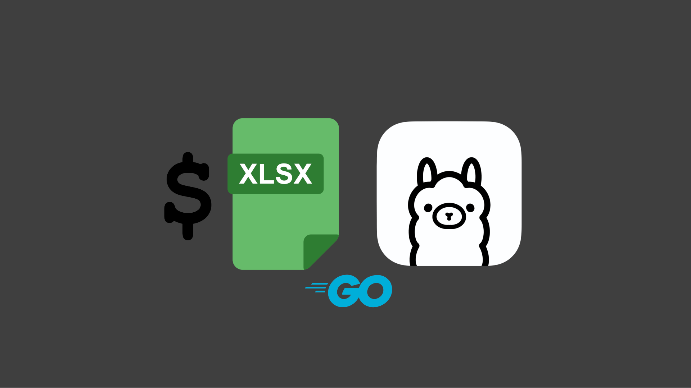

   

# LiberaDebt
A CLI app that passes your monthly financial obligations from an XLSX to Ollama to provide efficient payoff advice.

## Pre-requisites
* [**Ollama**](https://ollama.com)

## Usage
1. Download the [obligations.xlsx](https://github.com/nomadicGopher/LiberaDebt/blob/main/obligations.xlsx) template file.
    * _Column headers that include `*` are required, otherwise it will be optional_
    * _Reference [obligations_sample.xlsx](https://github.com/nomadicGopher/LiberaDebt/blob/main/obligations_sample.xlsx) as an example of how to use the template._
2. Fill out the financial obligations XLSX sheet which will contain 1 row per monthly obligation whether it is a reoccuring bill, loan payment, lifestyle expense or credit card payment.
    * Try to include as many obligations as possible like fuel, groceries, etc… so that the AI determines your remaining available balance accurately.
4. After saving the data, ensure that the XLSX file is stored in the same directory as the LiberaDebt executable program when it is either double clicked or run via the command line. See below if a different storage location is desired.

### Optional Command Line Arguments
When running via the command line with… `LiberaDebt -arg -arg …`
* `-data="/custom/path/to/file.xlsx"`
    *	**Default:** `./obligations.xlsx` (same directory as executable program)
* `-income="your monthly income"`
    * It doesn't matter if `$`, `,` or empty spaces are included.
    * User is prompted when this is not provided.
*	`-goal="your custom financial goal"`
    * ** Default:** Pay off debt as quickly and efficiently as possible while not straining my monthly budget.
 	  *	User is prompted when this is not different from the default.
*	`-model="get from the Ollama website"`
    *	**Default:** `0xroyce/Plutus-3B`
    *	**Alternative 1:** `0xroyce/plutus` (8B)
    * **Alternative 2:** `martain7r/finance-llama-8b:q4_k_m`

---

### Support This Developer
* [**GitHub Sponsors**](https://github.com/sponsors/nomadicGopher)
* [**Ko-Fi**](https://ko-fi.com/nomadicGopher)

  
<b>Crypto Currencies</b>

  <ul>
    <li><b>ETH</b>: 0x7531d86D5Dbda398369ec43205F102e79B3c647A</li>
    <li><b>BTC</b>: bc1qtkuzp85vph7y37rqjlznuta293qsay07cgg90s</li>
    <li><b>LTC</b>: ltc1q9pquzquaj6peplygqdrcxxvcnd5fcud7x80lh8</li>
    <li><b>DOGE</b>: DNQ3GHBVEcNpzXNeB7B4sPqd7L1GhUpMg3</li>
    <li><b>SOL</b>: EQ6QwibvKZsazjvQGJk6fsGW4BQSDS1Zs6Dj79HfVvME</li>
  </ul>

