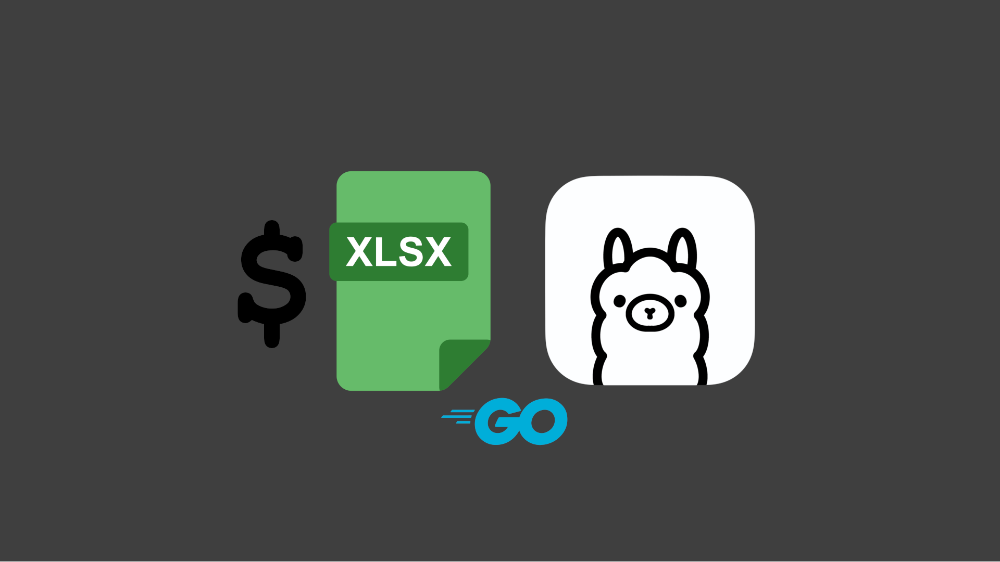

<p align="center">
   
</p>

# LiberaDebt
A CLI app that takes your monthly financial obligations from an XLSX file and uses Ollama to provide efficient payoff advice.

## Demo
_In order to quickly demonstrate useability, the Ollama model for this demo was downsized from the default qwen3:8b to qwen3:0.6b. Be aware that the default (8b) will produce more accurate responses and may take longer depending on your hardware._

<p align="center">
   
</p>

## Pre-requisites
* [**Ollama**](https://ollama.com) must be installed and running via `ollama serve`
* 8 GB of RAM (recommend 16 GB for better performance)
* Recommend a GPU for better performance

## Usage
1. Download the [obligations.xlsx](https://github.com/nomadicGopher/LiberaDebt/blob/main/obligations.xlsx) template file.
    * _Column headers with `*` are required; others are optional._
    * _See [obligations_sample.xlsx](https://github.com/nomadicGopher/LiberaDebt/blob/main/obligations_sample.xlsx) for an example of how to populate the data._
2. Fill out the XLSX sheet with one row per monthly obligation (recurring bills, loan payments, lifestyle expenses, credit card payments, etc.).
    * Include as many obligations as possible (fuel, groceries, etc.) so the AI can accurately determine your available balance.
3. Save the XLSX file in the same directory as the LiberaDebt executable, or specify a custom path with the `-data` argument.
4. Run the program:
    * Double-click the executable, or
    * Run from the command line with potential for arguments:
      ```sh
      LiberaDebt -data="/custom/path/to/obligations.xlsx" -income="3500"
      ```

### Optional Command Line Arguments
| Argument | Description | Default |
|----------|-------------|---------|
| `-data` | Path to your obligations XLSX file. It can be named differently but must use the template provided | `./obligations.xlsx` (current working directory) |
| `-income` | Your monthly income (after taxes & deductions). If not provided, you will be prompted to enter it.  _Avoid `$` if passing an argument since it will be treated as an environment variable. `$` is only acceptable if no argument is passed at runtime & you are prompted for an income. `,`, and spaces are acceptable regardless._ | _N/A_                                               |
| `-goal` | Your custom financial goal. If not different from the default, you will be prompted to confirm or enter a new goal. | `Provide a shortest-time payoff plan using any leftover budget for extra payments to loans and/or credit cards` |
| `-model` | Ollama model to use (see [Ollama models](https://ollama.com/library)) | `qwen3:8b` |
| `-excludeThink` | If true, removes `<think>...</think>` content from output file | `true` |

&nbsp;

---

<details>
  <summary><b>Support This Developer</b></summary>
  <br>
  Single or monthly contributions
  <ul>
   <li><a href="https://github.com/sponsors/nomadicGopher" target="_blank">GitHub Sponsors</a></li>
   <li><a href="https://ko-fi.com/nomadicGopher" target="_blank">Ko-Fi</a></li>
  </ul>
  Crypto currency wallets
  <ul>
      <li><b>ETH</b>: 0x7531d86D5Dbda398369ec43205F102e79B3c647A</li>
      <li><b>BTC</b>: bc1qtkuzp85vph7y37rqjlznuta293qsay07cgg90s</li>
      <li><b>LTC</b>: ltc1q9pquzquaj6peplygqdrcxxvcnd5fcud7x80lh8</li>
      <li><b>DOGE</b>: DNQ3GHBVEcNpzXNeB7B4sPqd7L1GhUpMg3</li>
      <li><b>SOL</b>: EQ6QwibvKZsazjvQGJk6fsGW4BQSDS1Zs6Dj79HfVvME</li>
  </ul>
</details>
